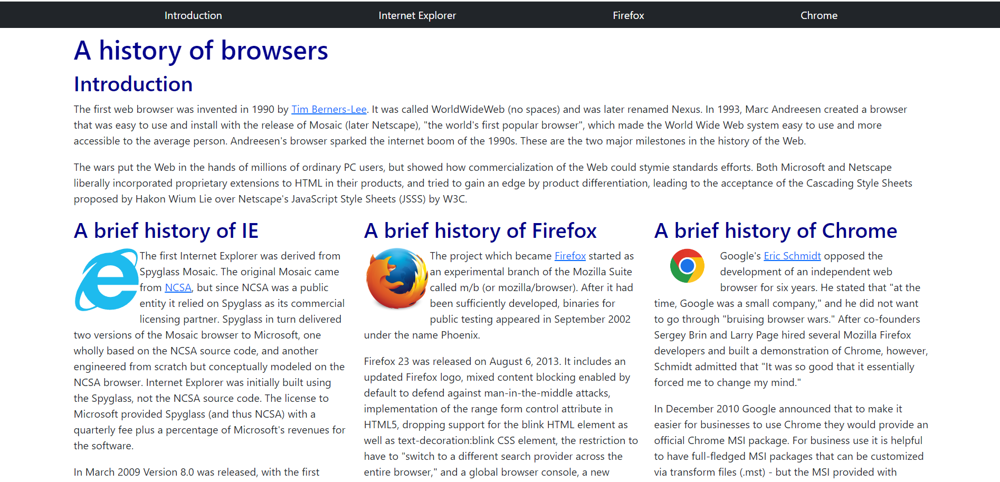
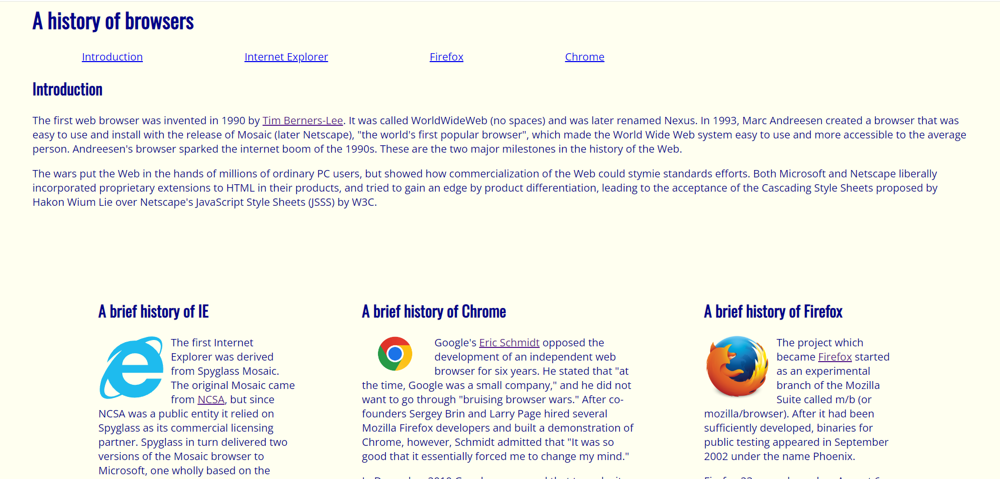

# BOOTSTRAP 5 VS HTML & CSS
There are many reasons why a software developer should learn how to use Bootstrap 5. To software developers who already have the knowledge and experience of creating websites using HTML and CSS, learning Bootstrap 5 will be an easy task. Bootstrap 5 has several advantages for creating responsive websites. One of the major advantages of using Bootstrap 5  is the extensive library with pre-designed components such as the navigation header. They also provide some shortcuts and visually appealing icons that you can implement on your own website. Bootstrap 5 not only provides you with amazing tools that you can utilize but there is also a large library of resources that they provide online to help software developers that are stuck or in the process of learning Bootstrap 5. This makes Bootstrap 5 more user-friendly and easier for software developers to find the information they need.

Although there are numerous advantages of using Bootstrap 5 it may not always be the most efficient framework to use when you are creating your own website. Firstly, as I mentioned before, only software developers who already have the knowledge and experience of creating websites using HTML and CSS will have an easier time using Bootstrap 5. Otherwise, Bootstrap 5 has a steep learning curve. Another Scenario where it is better to use HTML or CSS instead of bootstrap 5 is when the developer is creating small projects. Bootstrap 5, if not organized properly, can be hard to read when the project scope becomes larger therefore using just HTML and CSS may result in simpler and more readable code.

# BOOTSTRAP 5 VS ME
I’ve experienced many different coding standards throughout my time as a programmer from many different classes, and what I can vouch for is that learning these sets of rules helped me become a more experienced programmer. When I first started to code, my code organization was very messy. I remember typing one liner codes that I had to change which would take forever since I only had to parse through one line. As I got to higher level coding classes they started to enforce a more strict way of structuring my code and I couldn’t be more thankful. My code got easier to understand and I experienced way less errors. Although this was the case, I still catch myself breaking these coding standards. For example, leaving huge gaps between my lines of code or not commenting what functions do, so I definitely have ways to go before becoming a full pledge programmer.

