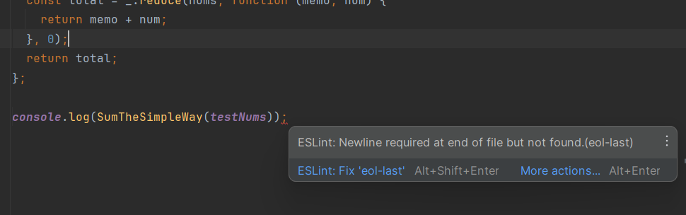

# Introduction To Coding Standards
Coding standards are a set of rules or guidelines that software engineers follow when they are writing code. Software engineers follow these standards because it aims to make sure consistency, readability, and maintainability are ensured across all types of software projects to reduce and minimize problems that might occur from code that does not follow these guidelines. There are also many rules in Coding Standards that can help many upcoming programmers learn how to code in their desired language.

# Improving Coding Habits 
I’ve experienced many different coding standards throughout my time as a programmer from many different classes, and what I can vouch for is that learning these sets of rules helped me become a more experienced programmer. When I first started to code, my code organization was very messy. I remember typing one liner codes that I had to change which would take forever since I only had to parse through one line. As I got to higher level coding classes they started to enforce a more strict way of structuring my code and I couldn’t be more thankful. My code got easier to understand and I experienced way less errors. Although this was the case, I still catch myself breaking these coding standards. For example, leaving huge gaps between my lines of code or not commenting what functions do, so I definitely have ways to go before becoming a full pledge programmer.
# Excited To Use IntelliJ
Since my long break from coding, I was excited to hear that we are going to be using an IDE for most of the coding that we are assigned to do for the rest of this semester. I got even more excited when I saw how good the IDE we were going to be using but the installation process was rough. Installing IntelliJ was a little tough, I couldn’t follow the instructions and ended up searching things online to get the IDE to work. The setup to get it to work is also a little tedious since everytime you create a project you have to install three files onto the project to start coding.

# Many Errors In IntelliJ

After finally installing all the necessary files and tweaking the settings to match the settings we have to use for our class, I was finally able to start coding. Before this I thought I was a decent coder or at least just a little below average but my lord did this IDE made me feel horrible. Everytime I typed a line there was always some error, then I realized how strict ESlint is and how specific it wants you to write code. But it is definitely useful since it tells you what the error is and even helps you fix it. This might be the case, but there are some pretty annoying errors. An example is not using a function you just made or not having a new line at the end of your code. Despite the initial struggles and occasional frustrations with strict rules, my experience with this IDE and ESLint has significantly improved my coding skills and attention to detail.
