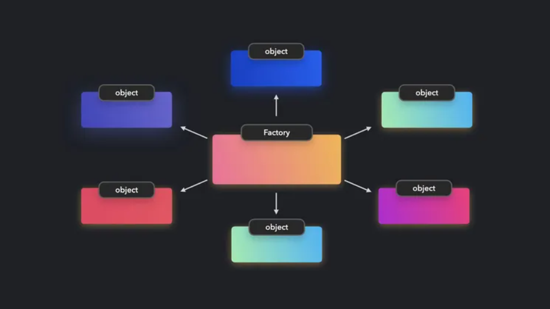

# Tools For Software Engineers

What I know about design patterns is that they are solutions to common problems in software design. They are essentially templates or guidelines that are used in various situations to solve similar problems or issues in software development. Software engineers often utilize them because they provide a standardized approach to solving problems, which speeds up the development process. Design patterns also prevent coders from reinventing the wheel since these patterns are already proven through many tests and in other developments. Another benefit of design patterns is the ease of communication they facilitate, as design patterns are familiar to all developers, helping those working in a team to understand each other better.


# A Coder's Toolbox
Looking at all the web app development I have done for this class, it’s easy for me to say that design patterns play an important role in how I approach solving my programming problems. An example of this is the project I am currently working on. I was tasked with developing a collection where it inserts users' information when the user decides to create a new account. I implemented the Singleton pattern to manage a central database connection that interacts with the users' collection. This design ensures that there is only one instance of this connection throughout the application, which is used across different modules to insert new user information when an account is created and to retrieve or manipulate user data as needed. This approach guarantees that all parts of the application that interact with the database do so through a single shared instance, thus maintaining consistency and preventing issues like multiple concurrent database connection instances.

<div style="text-align:left">
<p> These is the singular instance created using the Singleton Pattern Approach</p>
</div>

```javascript
class UsersCollection {
  constructor() {
    // The name of this collection.
    this.name = 'UsersCollection';
    // Define the Mongo collection.
    this.collection = new Mongo.Collection(this.name);
    // Define the structure of each document in the collection.
    this.schema = new SimpleSchema({
      email: { type: String, index: true, unique: true },
      firstName: { type: String, optional: true },
      lastName: { type: String, optional: true },
      title: {
        type: String,
        allowedValues: ['Student', 'Vendor'],
        defaultValue: 'Student',
      },
      picture: { type: String, optional: true },
    });
    // Ensure collection documents obey schema.
    this.collection.attachSchema(this.schema);
    // Define names for publications and subscriptions
    this.userPublicationName = `${this.name}.publication.user`;
    this.adminPublicationName = `${this.name}.publication.admin`;
  }
}

export const Users = new UsersCollection();

```

<a href="https://foodiefinders.lol/"><i class="large github icon "></i>Check Out The Functionality In My Groups Project </a>


In addition to the Singleton pattern, I also implemented the Factory pattern in this project to manage the creation of user objects based on different roles, such as students, vendors, and admins. Each type of user has distinct privileges: vendors can add restaurants and leave reviews; students can only leave reviews; and admins have the authority to add or remove restaurants and reviews. The Factory pattern simplifies how user objects are created based on different roles. It hides the complex logic of creating users with specific roles and privileges, making the process straightforward and adaptable. This approach is particularly effective as it enables the system to introduce new user types in the future without modifying the existing codebase. By utilizing the Factory pattern, the system dynamically allocates the appropriate permissions and functionalities to users depending on their role.

# Conclusion
In conclusion, design patterns are tools in a software developer's arsenal. By learning and applying these patterns, developers not only enhance their coding skills but also prepare to tackle complex problems with standardized solutions. In interviews and day-to-day coding alike, the knowledge of design patterns demonstrates a commitment to quality, efficiency, and collaborative problem-solving in software development. Whether you are a novice looking to get your feet wet or a seasoned professional aiming to refine your craft, understanding and utilizing design patterns is crucial for building sophisticated software that stands the test of time.


