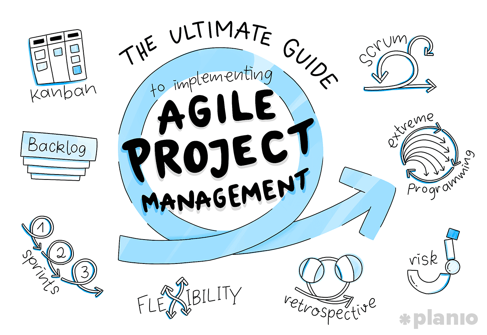
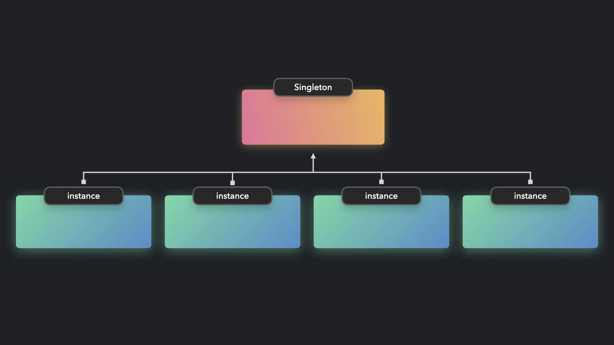

# Introduction
Many students, including me, thought that this class was all about web application development. The reason is that we have learned so much about web application development towards the end of the semester that many of us have forgotten the earlier parts. Many of my friends who are taking this class with me agree that they have learned more in the span of the last couple of weeks while working on the final project than in other parts of the semester. However, reflecting on the course as a whole, we have experienced many different software engineering concepts that have enhanced our understanding of the fundamentals of software engineering.

# Agile Adventures

One of the experiences that ICS 314 has through us is Agile management, especially using Issue Driven Project Management in GitHub. It has really opened my eyes to how flexible and useful it can be, not just for web apps but for other kinds of projects too. Agile Management is all about being adaptable and breaking things down into smaller, manageable tasks. Issue Driven Project Management helps us keep track of these tasks by setting them up as issues that anyone on the team can see, discuss, and update. This approach keeps everyone on the same page and makes it easy to see who's doing what. It’s pretty handy, and I can definitely see it working well for different kinds of projects like organizing big events. The clear structure and adaptability in handling tasks would really help in keeping things organized and moving smoothly, no matter the project type.

# Patterns In Play

Another experience we dove into  is Design Patterns, and I really got to see them in action during my final project. I was working with Meteor to create a collection that handled user info and displayed it on user profile pages. It had elements of a Singleton design pattern, because I made sure there was just one instance of the user collection that the whole app could access. This was super helpful for keeping the user data consistent everywhere it was used. Thinking about it now, the same idea could work for other stuff too and not just websites, for example in video game development a singleton might be used to manage the game's stats like keeping track of scores or progress which allows different parts of the game to access and update the state of the game. Design patterns are pretty handy tools; they help solve common problems in a lot of different projects, not just the ones on the web.

# Conclusion

Looking back at this semester in ICS 314, I’ve realized it wasn’t just about building cool web apps, it taught us way more. We really got into the nuts and bolts of stuff like Agile management and Design Patterns, learning skills that go way beyond just the web. These lessons weren’t just academic; they were super practical, showing us how to handle everything. Using GitHub to manage our tasks or applying design patterns in our final project, taught us key principles like being adaptable and solving problems efficiently. Moving forward, I’m excited to use what I’ve learned in all kinds of projects.
