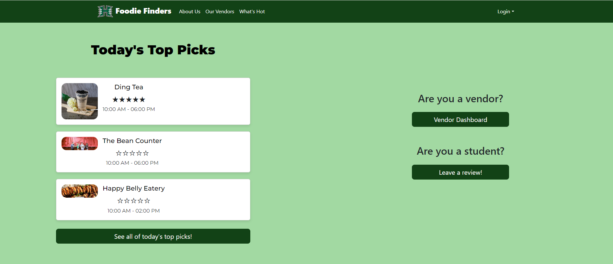
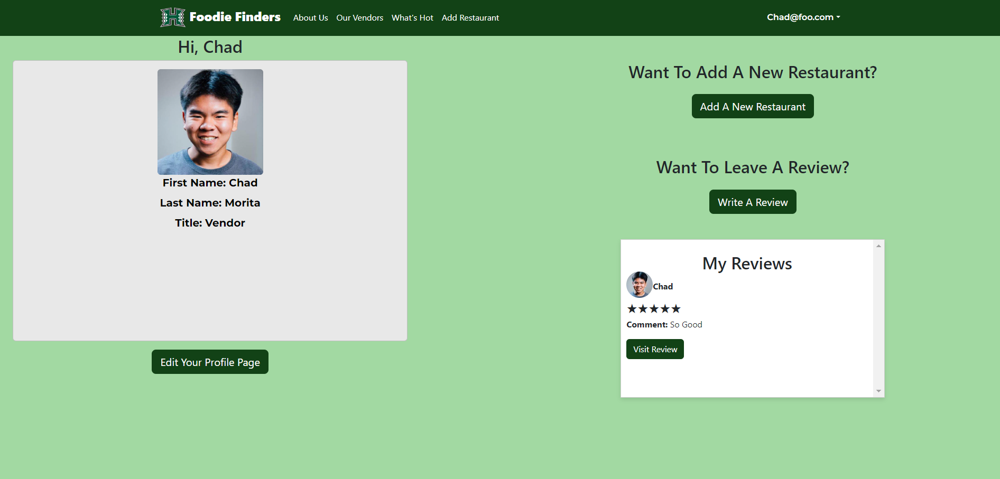

# Overview

The FoodieFinders web application allows users from the University of Manoa to find restaurants that are available on campus. Users can create an account and utilize the tools available on the website. If the user is a student, they can search for restaurants using a filter and leave reviews of restaurants they have eaten at. If the user is a vendor, they are allowed to create or add a restaurant to an existing collection of restaurants for students to see and review.

# Role

My role in this final project was to handle how user data is collected and displayed on the website. I created a collection to store user information such as their email, first name, last name, and profile picture. After the user signs up for the website and enters the information previously mentioned, they are able to view their profile on the "My Profile Page." On this page, the user can see the information they have entered and the reviews they have made on restaurants they have visited. They are also allowed to edit their account information and their reviews from this page. This page also has other small functionalities, such as redirecting users to the "Our Vendors Page," or if the user is a vendor, there is a functionality that allows them to be redirected to add their restaurant. I also had a small role with the reviews, where I used my collection to display the users' first names and their profile pictures on every review.

# What I learned

To be quite honest I learned more doing this final project than anything from the semester. It really help me build my teamwork skills since this was the first ever project I had to work with other team members for a coding project. I acquired numerous web development skills along with a deeper understanding of general coding practices, such as design patterns and coding standards. Since the project heavily utilized Meteor, it provided me with a comprehensive exposure to both front-end and back-end development, including interface design. Working with meteor, since I was in charge with user collection I learned to manage database operations and publish subscribe patterns. I hope to get to work more on full-stack frameworks such as meteor to improve my skills and get a deeper understanding on them.

If you wanna check out my groups Final Project this is the <a href="https://github.com/FoodieFinders/Foodie-Finders"><i class="large github icon "></i>Github Page</a> and this is the link to the website <a href="https://foodiefinders.lol/"><i class="large github icon "></i>foodiefinders.lol</a>
