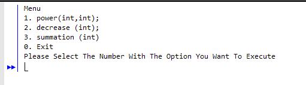

This is a small project that was assigned to me in ICS 211. I was tasked to make some simple math operations but the challenge was to use recursions for those operations. The code I created when run would open up a menu in the terminal that would ask the user to choose which operation they wanted to do. In this case, I coded for the power operation, a decrease function, and a summation operation. Although these were very simple operations, it took me a long time to figure out how to write the code in recursion.

This was an individual project. Normally you would use Java's built in libraries to solve for these simple operations, but needing to use recursion rather than rely on the libraries forced me to have to be creative with my thinking. There are many things that I could've done to improve this code like implementing a GUI or having more than just math operations. 

Overall, the purpose of this project was to get me familiar with using recursion. Although I still have problems implementing recursion to my code I at least have this project to look back and reference too when I'm having those tough times.

Here is a snippet of my code on how the recursive function for the power operation worked:
```java
      public static int power (int x, int y) {
         if ( y != 0) {
            
            return ( x * power( x , y - 1));
         }
         else {
            return 1;
         }
      }

```

Source: <a href="https://github.com/Rickiace/MathOperations"><i class="large github icon "></i>Rickiace/MathOperations</a>
