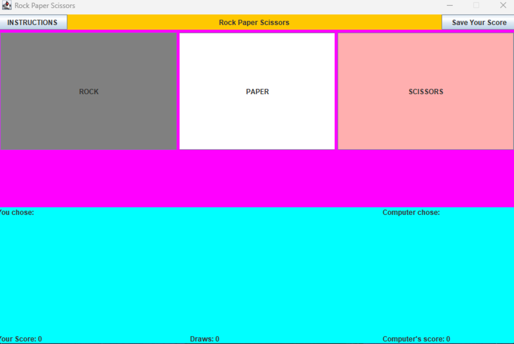

  

This Rock-Paper-Scissors game was a project that I made in ICS 211 using java. The purpose of the project was to improve our repertoire in the Java language by letting us create a game that utilizes GUI. 

When you initially run the application you are greeted with a small window with three buttons: rock, paper and scissors, which the player can click to select. The user is playing against the computer. Each turn, the interface will state what the player chose and what the computer chose. On the top of the window, there is also an instructions and save button. As the player continues to click either rock, paper, or scissors, the application will continue to save the scores of both the player and the computer and when you click the save your score button it will save your scores into a txt file.

This was an individual project and despite the fact that it was a relatively simple game, it was a challenge for me to make since this was my first time ever making a GUI. I ran into a lot of difficulties getting the game to work. I kept encountering problems where the buttons on the GUI interface would not work the way they were supposed to and panels not being in the right place .In the end with a lot of trial and errors I was able to finish the code and get the application running. Although this was probably the most difficult assignment throughout the entire class,I got to learn a lot of new things from the experience and especially how to create GUIs in Java.

Source: <a href="https://github.com/Rickiace/RockPaperScissors"><i class="large github icon "></i>Rickiace/RockPaperScissors</a>
